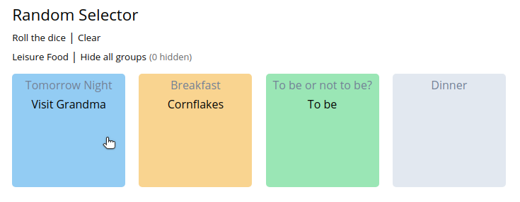

# Random Selector

A little offline tool to randomly select items from a dataset.



## Use cases

-   Get inspiration for tasks involving _composition_ in the broader sense:
    -   Musical composition
    -   Writing
    -   Painting
    -   Cooking
    -   ...
-   Get inspired while performing non-critical decisions
-   Brainstorming
-   Play around with concepts etc.

## Requirements

You only need a modern web browser (Firefox, Chrome, Safari, Edge, Brave...).

## Running the app

Clone or download the repository and open `index.html`.

Nothing exciting happens - because there is no data. To get a kickstart, just rename `data.example.js` to `data.js`. If you prefer to use your own data, just edit this file as desired. If you'd like to get a bird's eye view over your data, click the "Raw data" button to see all of your input data.

## Concept & data sourcing

Your data is structured in _clusters_ which contain similar _items_.

Rename `data.example.js` to `data.js` (or create a new `data.js` file) and insert your own data following the schema:

```js
let clusters = [
    {
        title: 'Breakfast',
        group: 'Food', // Optional
        items: ['Ham & Eggs', 'Cheese Sandwich', 'Cornflakes']
    }
];
```

In the above example, the JavaScript object is a cluster with the title 'Breakfast'. The different meals in the 'items' array are the items belonging to the cluster.

## Using the app

Each time you click on a cluster, a random item will be selected for each cluster. You can also randomize your whole cluster farm clicking on `Roll the dice`. To clear the results, click on `Reset`.

## Grouping

Clusters can be grouped in order to hide or show them groupwise. This way you can focus on a single group or multiple groups of clusters. In order to group clusters, add the same group property to each cluster ('Food' in the example above).
